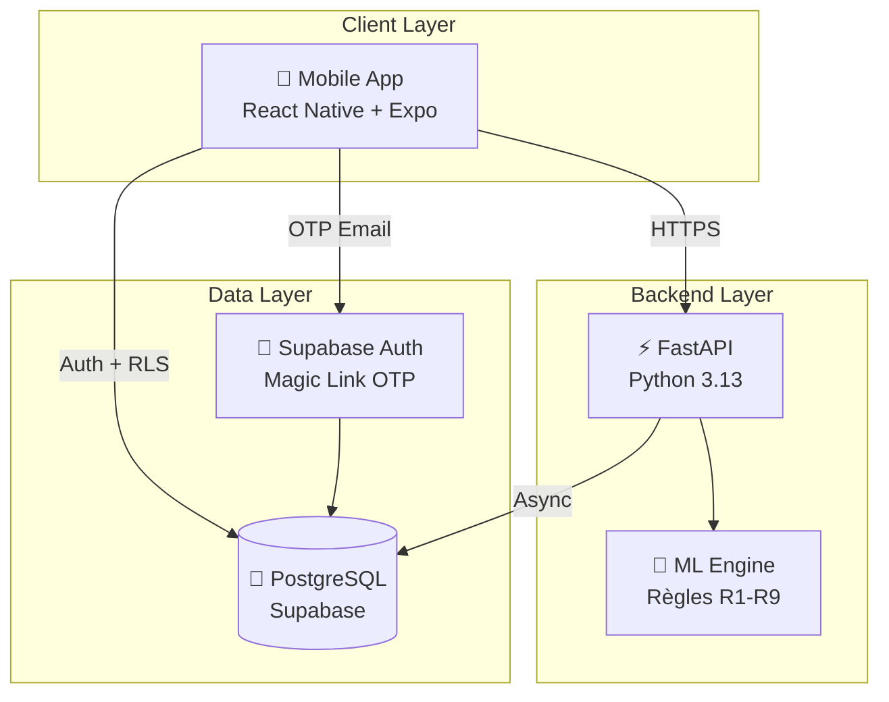
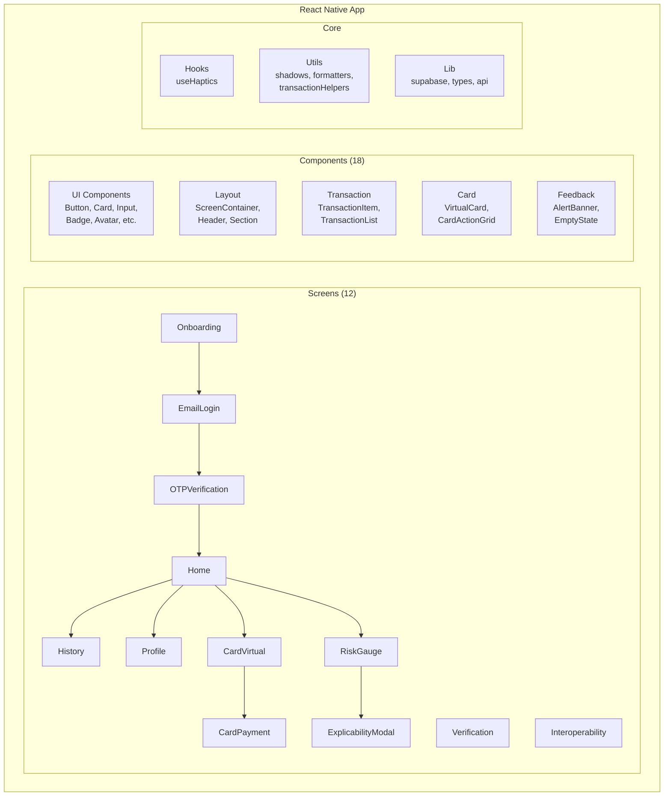
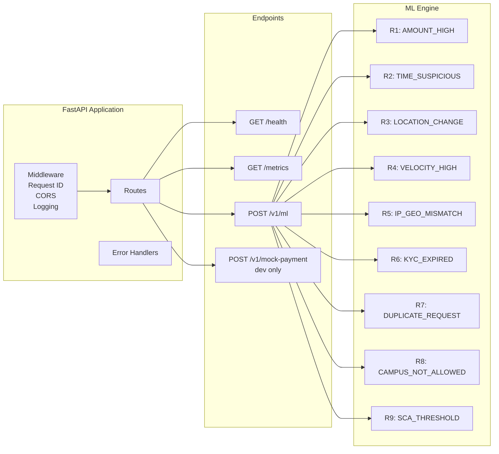
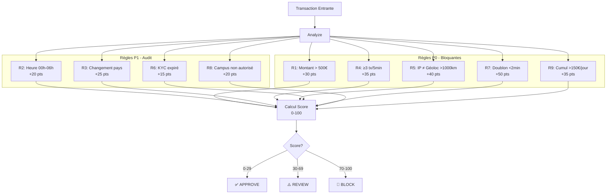
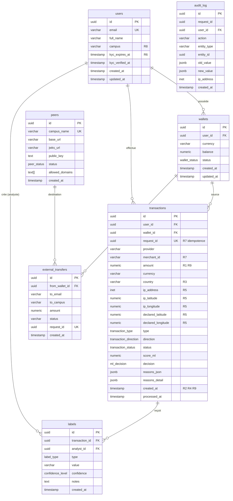
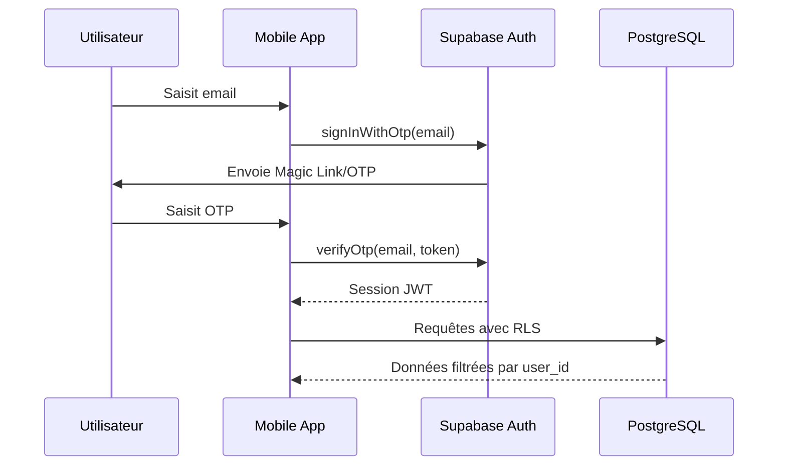
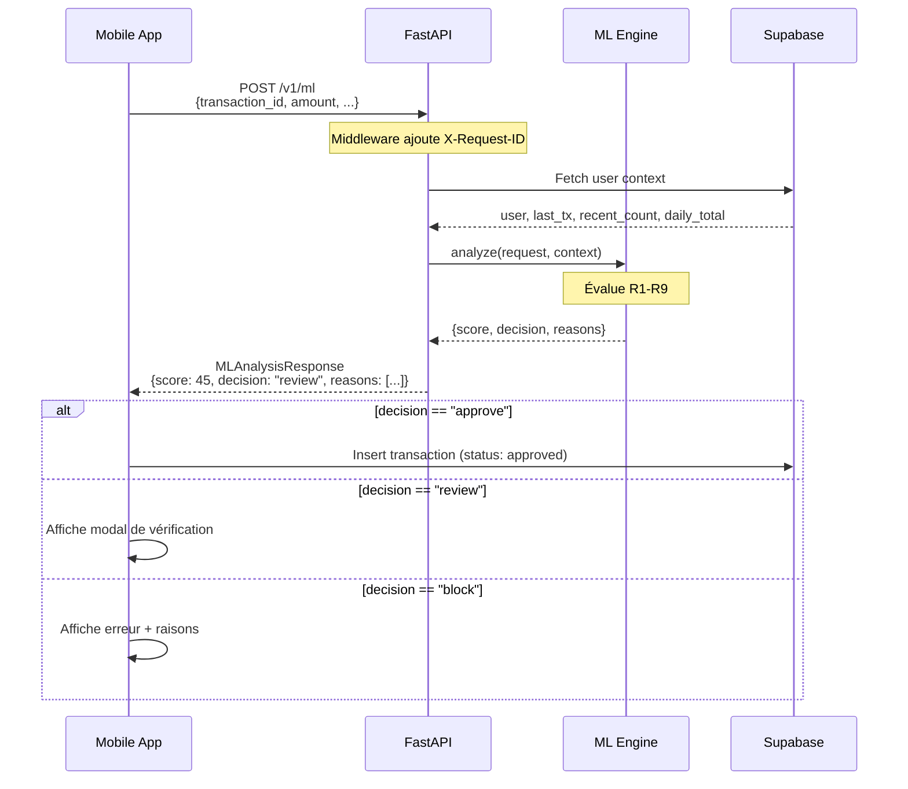
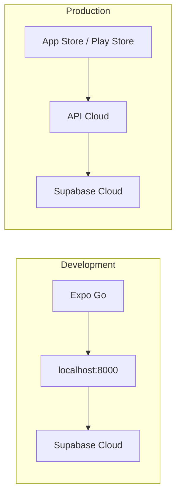

# Architecture Technique - Surphy Wallet

> Document d'architecture technique pour le portefeuille intelligent avec détection de fraude IA. Version ultra condensée visible dans le README

---

## Vue d'Ensemble



---

## Stack Technique

| Couche | Technologie | Version | Rôle |
|--------|-------------|---------|------|
| **Mobile** | React Native + Expo | SDK 52 | Application iOS/Android |
| **Styling** | NativeWind + Tailwind | v2 + 3.3.2 | Design system |
| **API** | FastAPI | Latest | Endpoints REST |
| **Runtime** | Python | 3.13 | Backend processing |
| **Database** | PostgreSQL (Supabase) | 15+ | Stockage données |
| **Auth** | Supabase Auth | Latest | Authentification OTP |
| **Security** | Row Level Security | - | Isolation des données |

---

## Architecture Mobile



### Structure des Fichiers Mobile

```
mobile/
├── src/
│   ├── App.tsx                    # Point d'entrée + Navigation
│   ├── screens/                   # 12 écrans
│   │   ├── OnboardingScreen.tsx   # Écran d'accueil
│   │   ├── EmailLoginScreen.tsx   # Saisie email
│   │   ├── OTPVerificationScreen.tsx
│   │   ├── HomeScreen.tsx         # Dashboard principal
│   │   ├── HistoryScreen.tsx      # Historique transactions
│   │   ├── ProfileScreen.tsx      # Profil utilisateur
│   │   ├── CardVirtualScreen.tsx  # Carte virtuelle
│   │   ├── CardPaymentScreen.tsx  # Paiement
│   │   ├── VerificationScreen.tsx # KYC
│   │   ├── InteroperabilityScreen.tsx
│   │   ├── RiskGaugeScreen.tsx    # Jauge de risque
│   │   └── ExplicabilityModal.tsx # Détails décision IA
│   ├── components/
│   │   ├── ui/                    # 8 composants UI
│   │   ├── layout/                # 3 composants layout
│   │   ├── transaction/           # 2 composants transaction
│   │   ├── card/                  # 2 composants carte
│   │   └── feedback/              # 3 composants feedback
│   ├── hooks/
│   │   └── useHaptics.ts          # Retour haptique
│   ├── utils/
│   │   ├── shadows.ts             # Ombres iOS/Android
│   │   ├── formatters.ts          # Formatage données
│   │   └── transactionHelpers.ts  # Helpers transactions
│   └── lib/
│       ├── supabase.ts            # Client Supabase
│       ├── types.ts               # Types TypeScript
│       └── api.ts                 # Appels API
├── tailwind.config.js             # Design system
└── babel.config.js                # Config NativeWind
```

---

## Architecture Backend



### Structure des Fichiers Backend

```
├── api/
│   ├── __init__.py
│   ├── main.py              # FastAPI app, middlewares, routes
│   └── database.py          # Client Supabase async
├── ml/
│   ├── __init__.py
│   └── engine.py            # Moteur de détection R1-R9
├── shared/
│   ├── __init__.py
│   └── models.py            # Schémas Pydantic
└── supabase/
    └── schema.sql           # Schéma complet PostgreSQL
```

---

## Moteur de Détection de Fraude



### Tableau des Règles

| ID | Code | Priorité | Seuil | Poids | Description |
|----|------|----------|-------|-------|-------------|
| R1 | `AMOUNT_HIGH` | P0 | > 500€ | +30 | Montant élevé |
| R2 | `TIME_SUSPICIOUS` | P1 | 00h-06h | +20 | Heure nocturne |
| R3 | `LOCATION_CHANGE` | P1 | Pays ≠ | +25 | Changement de pays |
| R4 | `VELOCITY_HIGH` | P0 | ≥ 3/5min | +35 | Vélocité élevée |
| R5 | `IP_GEO_MISMATCH` | P0 | > 1000km | +40 | IP/Géoloc incohérent |
| R6 | `KYC_EXPIRED` | P1 | Expiré | +15 | KYC expiré |
| R7 | `DUPLICATE_REQUEST` | P0 | < 2min | +50 | Requête dupliquée |
| R8 | `CAMPUS_NOT_ALLOWED` | P1 | Not in list | +20 | Campus non autorisé |
| R9 | `SCA_THRESHOLD` | P0 | > 150€/jour | +35 | Seuil SCA PSD2 |

---

## Schéma Base de Données



### Fonctions RPC (Performance)

| Fonction | Règle | Description |
|----------|-------|-------------|
| `count_recent_transactions(user_id, minutes)` | R4 | Compte les tx récentes |
| `sum_daily_transactions(user_id)` | R9 | Cumul journalier |
| `find_duplicate_transaction(...)` | R7 | Détecte les doublons |
| `get_last_transaction_country(user_id)` | R3 | Dernier pays |

---

## Flux d'Authentification



---

## Flux de Transaction



---

## Sécurité

### Row Level Security (RLS)

```mermaid
flowchart LR
    subgraph "Utilisateur Standard"
        U1[User A] -->|auth.uid() = id| U1_DATA[Ses données uniquement]
    end

    subgraph "Analyste @epitech.digital"
        ANALYST[Analyste] -->|LIKE '%@epitech.digital'| ALL_TX[Toutes les transactions]
        ANALYST -->|Créer/Voir| LABELS[Labels]
    end

    subgraph "Admin @admin.epitech.eu"
        ADMIN[Admin] -->|LIKE '%@admin.epitech.eu'| PEERS[Gestion Peers]
        ADMIN --> AUDIT[Audit Logs]
    end
```

### Politiques RLS par Table

| Table | Utilisateur | Analyste | Admin |
|-------|-------------|----------|-------|
| `users` | Own profile | - | - |
| `wallets` | Own wallets | - | - |
| `transactions` | Own tx | All tx | All |
| `labels` | - | Create/View | All |
| `peers` | View active | View active | Full |
| `audit_log` | - | - | View |

---

## Performance

### Objectifs

| Métrique | Cible |
|----------|-------|
| Latence ML p95 | < 100ms |
| Latence API p95 | < 300ms |
| Disponibilité | > 99.5% |

### Optimisations

- **Indexes PostgreSQL** optimisés pour chaque règle
- **Fonctions RPC** côté serveur (évite N+1)
- **Connection pooling** Supabase
- **Calcul Haversine** optimisé (R5)

### Index Critiques

```sql
-- R4: Vélocité
CREATE INDEX idx_transactions_user_created ON transactions(user_id, created_at DESC);

-- R7: Doublons
CREATE INDEX idx_transactions_duplicate_check ON transactions(user_id, amount, merchant_id, created_at DESC);

-- R9: Cumul journalier
CREATE INDEX idx_transactions_daily_sum ON transactions(user_id, created_at)
    WHERE status IN ('approved', 'pending');
```

---

## Environnements



### Variables d'Environnement

| Variable | Description | Requis |
|----------|-------------|--------|
| `SUPABASE_URL` | URL Supabase | ✅ |
| `SUPABASE_ANON_KEY` | Clé publique | ✅ |
| `SUPABASE_SERVICE_ROLE_KEY` | Clé admin (API only) | ✅ (API) |
| `LOG_LEVEL` | Niveau de log | ❌ (INFO) |
| `ENVIRONMENT` | dev/prod | ❌ (development) |

---

## Commandes

### Mobile

```bash
cd mobile
npm install
npx expo start          # Expo Go
npx expo run:ios        # Build iOS
npx expo run:android    # Build Android
```

### Backend

```bash
pip install -e ".[dev]"
uvicorn api.main:app --reload --port 8000
```

### Tests

```bash
pytest tests/ -v
mypy api/ ml/ shared/
ruff format .
```

---

**Dernière mise à jour:** Janvier 2026
